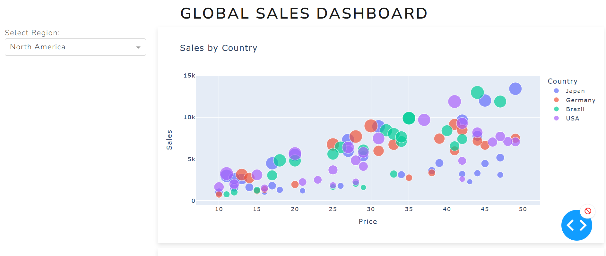

# 📊 Global Sales Dashboard

Welcome to the **Global Sales Dashboard**! This project uses **Plotly** and **Pandas** to create an interactive dashboard for visualizing sales data across regions, products, and time. The goal is to showcase data analysis and visualization skills in a sleek, engaging way.

---

## 🚀 **Project Overview**

This dashboard includes:
- **Sales by Region:** Bar chart showing total sales per region.
- **Monthly Sales Trend:** Line chart tracking sales over time.
- **Top 10 Products:** Bar chart highlighting best-selling products.
- **Correlation Heatmap:** Visualizing relationships between price, quantity sold, and sales.

The dashboard is fully interactive, allowing users to hover, zoom, and filter data dynamically.

---

## 📁 **Project Structure**

```
Global_Sales_Dashboard/
├── data/
│   └── sales_data.csv          # Sample sales data
├── notebooks/
│   └── analysis.ipynb          # Exploratory data analysis notebook
├── images/
│   └── sample_plot.png         # Visual examples for README
├── src/
│   ├── dashboard.py            # Main Python script for visualizations
│   └── utils.py                # Data processing functions
├── README.md                   # Project description and setup
├── requirements.txt            # Required libraries (pandas, plotly, etc.)
└── .gitignore                  # Files to ignore (e.g., checkpoints)
```

---

## ⚙️ **Setup Instructions**

1. **Clone the repository:**
```bash
git clone https://github.com/your-username/Global_Sales_Dashboard.git
cd Global_Sales_Dashboard
```

2. **Create a virtual environment:**
```bash
python -m venv venv
source venv/bin/activate   # On Windows use: venv\Scripts\activate
```

3. **Install dependencies:**
```bash
pip install -r requirements.txt
```

4. **Run the dashboard:**
```bash
python src/dashboard.py
```

5. **Explore the Jupyter notebook (optional):**
```bash
jupyter notebook notebooks/analysis.ipynb
```

---

## 📊 **Data**

The sample data (`sales_data.csv`) includes the following columns:
- **Date**: Date of the sale
- **Region**: Region of the sale
- **Country**: Country where the sale happened
- **Product**: Product name
- **Price**: Price per unit
- **Quantity_Sold**: Number of units sold

---

## 📈 **Visualizations**

Examples of visualizations:



---

## ⭐ **Features to Add**

- [ ] Add a dropdown filter for selecting specific regions or products
- [ ] Implement a time range slider for more flexible trend analysis
- [ ] Deploy the dashboard using Streamlit or a similar service

---

## 📬 **Contact**

For any questions or suggestions, feel free to reach out via [LinkedIn](your-linkedin-url) or open an issue in this repo.

---

**Showcase your data skills with this interactive dashboard — happy coding!** ✨

